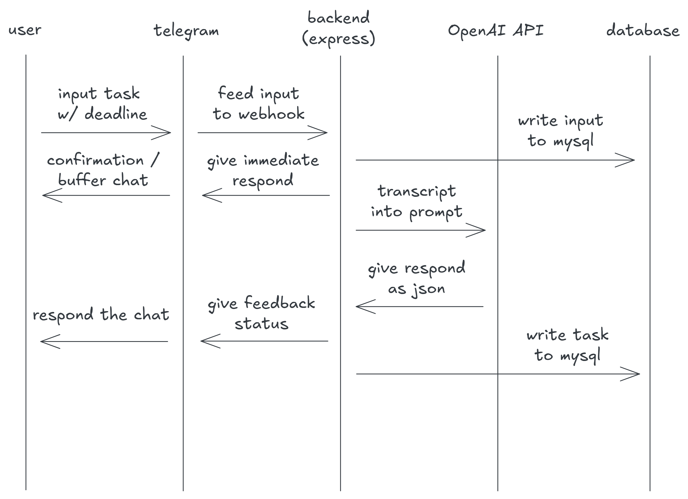
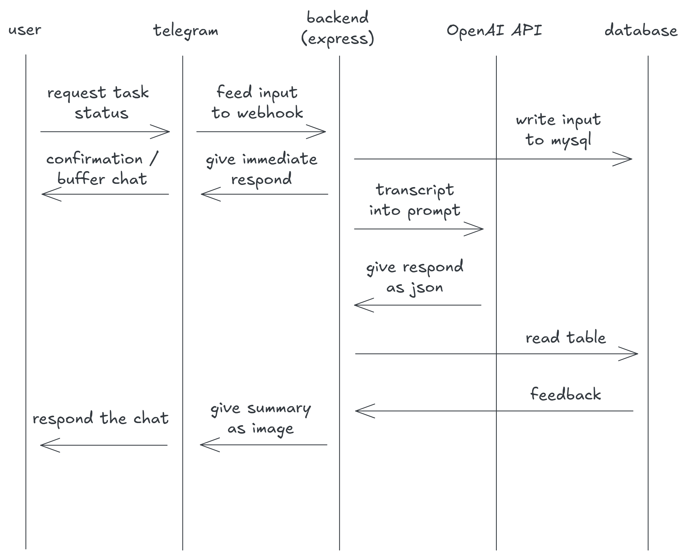

# 🤖 Butler AI: Autonomous Personal Assistant & Task Pipeline

[](#)

**Butler AI** bukan sekadar bot Telegram biasa. Ini adalah ekosistem asisten pribadi berbasis LLM (Large Language Model) yang dirancang untuk menangani *unstructured data* (chat) menjadi *structured tasks* yang dapat dikelola secara sistematis.

Sebagai proyek portofolio **Data Engineering**, fokus utama sistem ini adalah pada **data integrity, schema design, dan efisiensi alur pemrosesan pesan.**

---

## 🏗️ System Architecture & Data Flow

Sistem ini membagi pemrosesan menjadi dua jalur utama sesuai dengan blueprint desain:

### 1. Ingestion Pipeline (Input Task)
Mengubah input natural language dari Telegram menjadi entri database yang terstruktur.


### 2. Retrieval & Action Pipeline (Request Task)
Mengambil data (querying) berdasarkan konteks user dan melakukan aksi yang diminta.


---

## 🛠️ Data Engineering Stack

- **Runtime:** [Node.js](https://nodejs.org/) - Event-driven architecture untuk handling webhook Telegram.
- **ORM:** [Prisma](https://www.prisma.io/) - Memastikan *type-safety* dan migrasi skema database yang terkontrol.
- **Database:** [MySQL](https://www.mysql.com/) - Relational storage untuk manajemen state user, task, dan log aktivitas.
- **Infrastructure:** [Docker & Docker Compose](https://www.docker.com/) - Containerization untuk kemudahan deployment dan isolasi environment database.
- **AI Integration:** OpenAI/Gemini API - Digunakan sebagai *logic engine* untuk ekstraksi entitas.

---

## 📊 Database Schema Design (The Core)

Salah satu keunggulan proyek ini adalah perancangan skema yang scalable menggunakan Prisma.

```prisma
// Core Schema Entities
model User {
    id        BigInt   @id @unique
    username  String?
    tasks     Task[]
    chats     Chat[]
    @@map("users")
}

model Task {
    id          Int       @id @default(autoincrement())
    taskType    String    @map("task_type") // task, bug, feature
    title       String
    status      String    @default("todo")
    userId      BigInt    @map("user_id")
    users       User      @relation(fields: [userId], references: [id])
    reminders   Reminder[]
    @@map("tasks")
}
```

**Key Engineering Highlights:**
- **Normalization:** Memastikan data user, task, dan project terpisah dengan relasi yang tepat.
- **Data Typing:** Penggunaan `BigInt` untuk ID Telegram guna memastikan kompatibilitas dengan rentang ID API Telegram.
- **Indexing:** Optimasi query pada primary keys dan unique constraints untuk performa tinggi.

---

## 🚀 Key Features

- **Natural Language Task Extraction:** Kirim pesan seperti "Ingatkan saya meeting jam 2 siang" dan sistem akan mengekstrak informasi menjadi record database yang terstruktur.
- **Contextual Retrieval:** Mencari tugas atau informasi berdasarkan konteks percakapan sebelumnya.
- **Automated Reminders:** Sistem pengingat otomatis berdasarkan entri `Reminder` yang terhubung dengan `Task`.
- **Dockerized Environment:** Seluruh stack (Bot + MySQL) dapat dijalankan hanya dengan satu perintah `docker-compose up`.

---

## 🛠️ Installation & Setup

1. **Clone & Install:**
   ```bash
   git clone https://github.com/royandhika/telebot-assistant.git
   npm install
   ```

2. **Environment Setup:**
   Buat file `.env` di dalam folder `telebot` dan isi token Telegram serta URL database.

3. **Database Migration:**
   ```bash
   npx prisma migrate dev
   ```

4. **Run with Docker:**
   ```bash
   docker-compose up -d
   ```

---

## 📈 Future Roadmap (Engineering Perspective)
- [ ] **Vector Database Integration:** Menambahkan Pinecone/Milvus untuk *Long-term memory* menggunakan RAG (Retrieval-Augmented Generation).
- [ ] **Message Queuing:** Implementasi Redis BullMQ untuk menangani lonjakan pesan (high availability).
- [ ] **Advanced Analytics:** Pipeline data untuk menganalisis pola produktivitas user.

---
Developed with ❤️ by Roy
